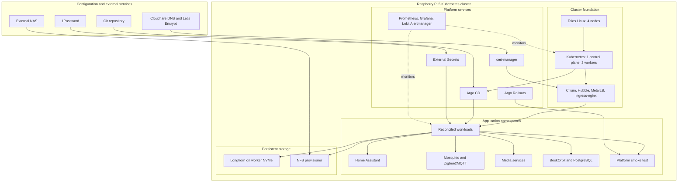

# Talos Kubernetes Homelab

This repository contains the configuration for a four-node Kubernetes homelab running on Raspberry Pi 5 hardware and Talos Linux. Argo CD deploys and reconciles platform services and workloads from Git. The cluster runs persistent home-automation, media, and application workloads. I use it to build practical experience with GitOps, networking, storage, secrets management, observability, and progressive delivery.

[Architecture](#architecture) · [Platform capabilities](#platform-capabilities) · [Workloads](#workloads) · [Deployment model](#deployment-model) · [Engineering trade-offs](#engineering-decisions-and-trade-offs)

## Platform highlights

| Capability | Implementation |
|---|---|
| Immutable node operating system | Talos Linux configuration generated from versioned machine patches |
| GitOps reconciliation | Argo CD Applications with automated sync, pruning, and self-healing |
| eBPF networking | Cilium with kube-proxy replacement, dual-stack addressing, Hubble, and Gateway API |
| Persistent storage | Longhorn on dedicated worker NVMe volumes; NFS for large shared datasets |
| External secrets | External Secrets Operator authenticates to 1Password and creates Kubernetes Secrets |
| Automated certificates | cert-manager issues Let's Encrypt certificates through Cloudflare DNS-01 |
| Metrics and logs | Prometheus, Alertmanager, Grafana, Loki, and Promtail |
| Supplemental node cooling | Opt-in Raspberry Pi 5 RP1 PWM fan controller with one-node canary rollout |
| Progressive delivery | Argo Rollouts canaries with analysis steps against a dedicated smoke-test workload |
| Dependency maintenance | Renovate groups Helm chart and container-image updates into reviewable pull requests |
| Persistent workloads | Home Assistant, Zigbee2MQTT, media services, and BookOrbit |

## Architecture

Talos defines the operating system and Kubernetes configuration on the physical nodes. Argo CD takes over after Kubernetes and Cilium are running and reconciles platform services and workloads from Git.



Talos handles node and Kubernetes configuration, while Argo CD manages the platform above it. Longhorn stores cluster-managed application state on worker NVMe volumes; NFS provides access to large shared datasets on the NAS.

### Cluster topology

The cluster contains one control-plane node and three workers. Talos is configured to install and run from `/dev/nvme0n1`; the repository does not define an SD system disk. On each worker, a Talos `UserVolumeConfig` selects a second NVMe device that is explicitly not the system disk and assigns it to Longhorn. This keeps Kubernetes-managed application data on a separate physical device.

| Node | Role | Storage responsibility |
|---|---|---|
| `rpi-cp-1` | Control plane | Talos system NVMe |
| `rpi-w-1` | Worker | Talos system NVMe and separate Longhorn NVMe |
| `rpi-w-2` | Worker | Talos system NVMe and separate Longhorn NVMe |
| `rpi-w-3` | Worker | Talos system NVMe and separate Longhorn NVMe |

The machine patches also configure kubelet certificate rotation, the kernel modules and mount propagation required by Longhorn, IPv4 and IPv6 pod and service networks, and the worker kubelet image required for iSCSI userland support.

### GitOps reconciliation

`gitops/infra-helm` renders an Argo CD Application for each enabled component. Applications source either an upstream Helm chart or a local path under `gitops/infra-custom` and use automated sync with pruning and self-healing.

Initial Talos configuration, Cilium installation, and Argo CD bootstrap sit outside normal reconciliation because Kubernetes and Argo CD must exist first. Platform services and workloads follow the GitOps path after that boundary.

## Repository structure

```text
.
├── cilium/                 # Cilium values and shared Gateway API resources
├── docs/                   # Operational documentation
├── gitops/
│   ├── argocd/             # Argo CD bootstrap through Kustomize and Helm
│   ├── infra-helm/         # Platform Application chart and central feature values
│   └── infra-custom/       # Custom charts and workload manifests
├── patches/                # Talos control-plane, worker, and storage patches
├── nodes.yaml              # Cluster endpoint, VIP, and node inventory
├── generate.sh             # Talos client and machine-config generation
└── apply.sh                # Authenticated Talos machine-config updates
```

`gitops/infra-helm/values.yaml` contains the main feature switches and pinned platform versions. Workload-specific templates live with their applications under `gitops/infra-custom`; the Argo CD bootstrap remains isolated under `gitops/argocd`.

## Platform capabilities

### Networking and ingress

Cilium runs in Kubernetes IPAM mode with kube-proxy replacement enabled. The Talos configuration declares dual-stack pod and service CIDRs, and Hubble Relay and Hubble UI provide network-flow visibility.

ingress-nginx serves existing Ingress resources, while a shared Cilium Gateway supports newer HTTPRoute-based workloads. MetalLB allocates service addresses from a fixed LAN pool and advertises them in L2 mode.

The Tailscale operator provides remote access through a home-LAN subnet router and exit node. Its OAuth credentials are delivered through External Secrets rather than stored in Git.

### Persistent storage

Longhorn stores Kubernetes-managed application state on dedicated worker NVMe volumes formatted with XFS. Large shared media and book datasets remain on the NAS and are provisioned through NFS. Talos system disks are kept separate from Longhorn data volumes.

Home Assistant, Grafana, Loki, Mosquitto, Zigbee2MQTT, and BookOrbit use Longhorn-backed claims. Media applications consume shared NFS storage through the NFS subdir external provisioner.

### Secrets and certificate management

External Secrets authenticates to 1Password and creates namespace-scoped Kubernetes Secrets for workloads. Applications consume those Secrets through `secretKeyRef`, `envFrom`, or chart-specific existing-secret settings. The 1Password service account token is provided once during bootstrap because External Secrets needs it before the controller can retrieve other credentials.

cert-manager uses a Cloudflare credential supplied through External Secrets to complete DNS-01 challenges. Let's Encrypt certificates are then attached to ingress resources through the `letsencrypt-dns` ClusterIssuer.

### Observability and operations

Prometheus collects cluster and application metrics with a 30-day retention target. Alertmanager handles alert routing, while kube-state-metrics and node-exporter expose Kubernetes and node state.

Loki runs in single-binary mode with Longhorn-backed filesystem storage and seven-day retention. Promtail collects node and container logs and applies additional parsing to the control-plane link watchdog.

The opt-in `pi5-fan-control` node agent supplies high-temperature cooling from the Waveshare HAT fans while the external Noctua fans provide continuous baseline airflow. It is canary-labeled only on `rpi-w-2`; direct RP1 register access is isolated in a dedicated privileged namespace until Talos provides native RP1 PWM support.

Grafana is provisioned with Prometheus and Loki data sources, upstream component dashboards, and repository-managed dashboards for control-plane link stability and the platform smoke-test workload. The `cp-link-watchdog` DaemonSet records network-link events. `homelab-platform-smoke` exposes health checks and metrics used by the rollout analysis and dashboards.

### Progressive delivery and dependency management

The smoke-test application uses an Argo Rollouts canary strategy. Canary weight advances through 20%, 50%, and 100% stages with timed pauses and analysis steps. This gives me a predictable workload for checking rollout behaviour, metrics, and alerts.

Renovate tracks annotated Helm versions and pinned container images. Helm chart and container updates are grouped separately so rendered changes and upstream release notes can be reviewed before merge.

## Workloads

### Home Assistant and irrigation automation

Home Assistant runs with Longhorn-backed persistence and manages several household automations, including climate control and garden irrigation. Repository-managed packages and Lovelace snippets implement the Rain Bird controls with individual zone runs, sequential programs, confirmation of active zones, and timer-based stopping.

### Zigbee2MQTT and Mosquitto

Mosquitto and Zigbee2MQTT run in a dedicated `home-automation` namespace. Zigbee2MQTT connects to a network-attached SMLIGHT coordinator over TCP, avoiding USB passthrough and privileged host-device access. MQTT credentials come from 1Password through External Secrets; Mosquitto remains cluster-internal and the Zigbee2MQTT frontend is exposed through TLS ingress.

### Media services

The media stack includes Sonarr, Radarr, Prowlarr, qBittorrent Enhanced Edition, Seerr, Profilarr, and FlareSolverr. Kubernetes-managed configuration volumes are separated from shared media data on NFS.

### BookOrbit

BookOrbit runs with a dedicated PostgreSQL StatefulSet, Longhorn-backed application and database claims, an NFS-backed books volume, External Secrets-managed credentials, and TLS ingress.

## Deployment model

### Initial bootstrap

The initial deployment follows six stages:

1. define nodes, addresses, and Talos settings in `nodes.yaml` and `patches/`;
2. generate Talos machine configuration with `generate.sh`;
3. apply the initial machine configuration and bootstrap Kubernetes;
4. install Cilium and the required Gateway API resources;
5. bootstrap Argo CD;
6. apply the platform Application chart and let Argo CD reconcile the cluster.

Representative local rendering commands:

```bash
helm template infra-apps gitops/infra-helm
kustomize build --enable-helm gitops/argocd
```

The complete procedure, prerequisites, configuration overrides, and reconfiguration workflow are documented in [`docs/bootstrap.md`](docs/bootstrap.md).

### Day-to-day GitOps workflow

1. Update the relevant values or manifest.
2. Render the affected Helm or Kustomize output locally.
3. Review the source and rendered diffs.
4. Commit and push the change.
5. Allow Argo CD to reconcile the affected Application.

Argo CD reports drift and reconciliation state, while Git retains the reviewed configuration changes.

## Engineering decisions and trade-offs

- **Control-plane topology:** I currently run one control-plane node so that three of the four nodes remain available for workloads and Longhorn replicas. The API uses a VIP, but the control plane itself is not highly available.
- **Storage placement:** I keep Kubernetes-managed application state on Longhorn, while large media and book datasets remain on the NAS. This avoids replicating bulk data across the worker NVMe volumes.
- **Bootstrap boundary:** Talos, Cilium, and Argo CD have to be installed before GitOps reconciliation can start. Once Argo CD is running, platform and workload changes are made through Git.
- **Observability footprint:** Prometheus, Grafana, and Loki run with retention and storage sized for the available hardware. Grafana and Loki use single replicas, so they can be unavailable during node or volume recovery.

## Roadmap

- Add repeatable repository validation and secret scanning for public changes.
- Document Longhorn and application-data restore procedures.
- Evaluate Kyverno in audit mode and measure the resource cost of Trivy Operator before enabling either component.
- Improve control-plane recovery documentation and test the recovery workflow.
- Separate remaining environment-specific configuration through clearer overlays and reusable examples.
