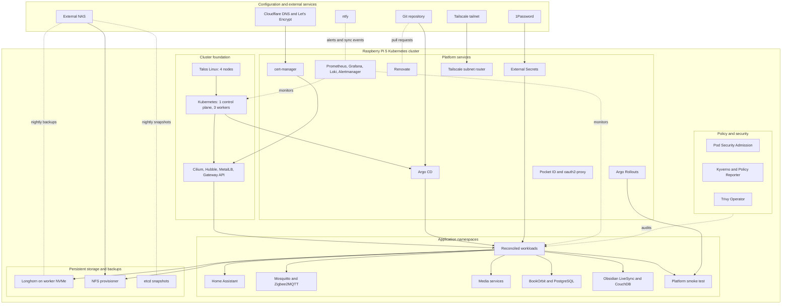

# Talos Kubernetes Homelab

[](https://github.com/Alphaegen/talos-kubernetes-homelab/actions/workflows/validate.yaml)

This repository contains the configuration for a four-node Kubernetes homelab running on Raspberry Pi 5 hardware and Talos Linux. Argo CD deploys and reconciles platform services and workloads from Git. The cluster runs persistent home-automation, media, and application workloads. I use it to build practical experience with GitOps, networking, storage, identity, policy and security scanning, secrets management, observability, and progressive delivery.

[Architecture](#architecture) · [Platform capabilities](#platform-capabilities) · [Workloads](#workloads) · [Deployment model](#deployment-model) · [Engineering trade-offs](#engineering-decisions-and-trade-offs)

## Platform highlights

| Capability | Implementation |
|---|---|
| Immutable node operating system | Talos Linux configuration generated from versioned machine patches |
| GitOps reconciliation | Argo CD Applications with automated sync, pruning, and self-healing, split into `platform` and `apps` AppProjects, with sync and health notifications to ntfy |
| Single sign-on | Pocket ID (passkeys) as the OIDC provider; Argo CD and Grafana sign in natively with group-based roles, and oauth2-proxy protects UIs without their own login |
| eBPF networking | Cilium with kube-proxy replacement, dual-stack addressing, Hubble, and a single Gateway API ingress; Tailscale for remote access |
| Persistent storage | Longhorn on dedicated worker NVMe volumes; NFS for large shared datasets |
| Backups | Nightly Longhorn volume backups and etcd snapshots to the NAS, with a documented control-plane recovery procedure |
| External secrets | External Secrets Operator authenticates to 1Password and creates Kubernetes Secrets |
| Policy as code | Kyverno CEL policies for the restricted Pod Security Standard, image tags and resources, with documented exceptions, CI tests, and Policy Reporter behind SSO; Pod Security Admission enforces baseline on every namespace unless a documented override applies |
| Vulnerability scanning | Trivy Operator scans running images for fixable high and critical CVEs and reports configuration and compliance findings, with a Grafana dashboard and an alert for new critical CVEs |
| Automated certificates | cert-manager issues Let's Encrypt certificates through Cloudflare DNS-01 |
| Metrics and logs | Prometheus, Alertmanager, Grafana, Loki, and Grafana Alloy, including Cilium, Hubble, and MetalLB metrics; alerts go to ntfy |
| Resource management | Requests and memory limits sized from observed usage; PriorityClasses keep home automation running under memory pressure |
| Supplemental node cooling | Opt-in Raspberry Pi 5 RP1 PWM fan controller on all four nodes, rolled out after a one-node canary |
| Progressive delivery | Argo Rollouts canaries with analysis steps against a dedicated smoke-test workload |
| Dependency maintenance | Self-hosted Renovate runs in the cluster and groups Helm chart, container-image, GitHub Actions, and CI tool updates into reviewable pull requests |
| Repository validation | GitHub Actions renders every Application source, validates schemas with kubeconform, and scans new commits with gitleaks |
| Workloads | Home Assistant, Zigbee2MQTT, media services, BookOrbit, and Obsidian LiveSync |

## Architecture

Talos defines the operating system and Kubernetes configuration on the physical nodes. Argo CD takes over after Kubernetes and Cilium are running and reconciles platform services and workloads from Git.


```mermaid
flowchart TB
    subgraph external["Configuration and external services"]
        direction LR
        git["Git repository"]
        onepassword["1Password"]
        publicdns["Cloudflare DNS and Let's Encrypt"]
        nas["External NAS"]
        ntfy["ntfy"]
        tailnet["Tailscale tailnet"]
    end

    subgraph cluster["Raspberry Pi 5 Kubernetes cluster"]
        direction TB

        subgraph foundation["Cluster foundation"]
            direction LR
            talos["Talos Linux: 4 nodes"]
            kubernetes["Kubernetes: 1 control plane, 3 workers"]
            networking["Cilium, Hubble, MetalLB, Gateway API"]
            talos --> kubernetes --> networking
        end

        subgraph platform["Platform services"]
            direction LR
            argocd["Argo CD"]
            eso["External Secrets"]
            certificates["cert-manager"]
            rollouts["Argo Rollouts"]
            renovate["Renovate"]
            observability["Prometheus, Grafana, Loki, Alertmanager"]
            identity["Pocket ID and oauth2-proxy"]
            remote["Tailscale subnet router"]
        end

        subgraph security["Policy and security"]
            direction LR
            psa["Pod Security Admission"]
            kyverno["Kyverno and Policy Reporter"]
            trivy["Trivy Operator"]
        end

        subgraph applications["Application namespaces"]
            direction LR
            appentry["Reconciled workloads"]
            homeassistant["Home Assistant"]
            automation["Mosquitto and Zigbee2MQTT"]
            media["Media services"]
            bookorbit["BookOrbit and PostgreSQL"]
            livesync["Obsidian LiveSync and CouchDB"]
            smoke["Platform smoke test"]
            appentry --> homeassistant
            appentry --> automation
            appentry --> media
            appentry --> bookorbit
            appentry --> livesync
            appentry --> smoke
        end

        subgraph storage["Persistent storage and backups"]
            direction LR
            longhorn["Longhorn on worker NVMe"]
            nfs["NFS provisioner"]
            etcdbackup["etcd snapshots"]
        end

        kubernetes --> argocd
        networking --> appentry
        argocd --> appentry
        eso --> appentry
        certificates --> networking
        rollouts --> smoke
        observability -. monitors .-> kubernetes
        observability -. monitors .-> appentry
        security -. audits .-> appentry
        appentry --> longhorn
        appentry --> nfs
    end

    git --> argocd
    git -. pull requests .- renovate
    onepassword --> eso
    publicdns --> certificates
    tailnet --> remote
    nas --> nfs
    nas -. nightly backups .- longhorn
    nas -. nightly snapshots .- etcdbackup
    ntfy -. alerts and sync events .- observability
```

Talos handles node and Kubernetes configuration, while Argo CD manages the platform above it. Longhorn stores cluster-managed application state on worker NVMe volumes; NFS provides access to large shared datasets on the NAS, which also holds the nightly backups.

### Cluster topology

The cluster contains one control-plane node and three workers. Live Talos volume inventory confirms that all four nodes boot from SD cards: the Talos `STATE` and `EPHEMERAL` partitions are `/dev/mmcblk0p5` and `/dev/mmcblk0p6`. On each worker, a Talos `UserVolumeConfig` selects the separate NVMe device and assigns `/dev/nvme0n1p1` to Longhorn. This keeps Kubernetes-managed application data on a separate physical device.

| Node | Role | Storage responsibility |
|---|---|---|
| `rpi-cp-1` | Control plane | Talos system SD card |
| `rpi-w-1` | Worker | Talos system SD card and separate Longhorn NVMe |
| `rpi-w-2` | Worker | Talos system SD card and separate Longhorn NVMe |
| `rpi-w-3` | Worker | Talos system SD card and separate Longhorn NVMe |

The control-plane NVMe has an unmounted historical `u-longhorn` partition but
is not registered with Longhorn and hosts no active replicas. It is preserved
and excluded from Talos install/recovery targets. See
[`docs/control-plane-recovery.md`](docs/control-plane-recovery.md) for the exact
disk identity and recovery safeguards.

The machine patches also configure kubelet certificate rotation, the kernel modules and mount propagation required by Longhorn, IPv4 and IPv6 pod and service networks, and the worker kubelet image required for iSCSI userland support.

### GitOps reconciliation

`gitops/infra-helm` renders an Argo CD Application for each enabled component. Applications source either an upstream Helm chart or a local path under `gitops/infra-custom` and use automated sync with pruning and self-healing.

The Applications are split across two AppProjects. `platform` holds controllers, storage, networking, monitoring, and auth; it may install cluster-scoped resources, but only into its listed namespaces. `apps` holds the user-facing workloads, limited to their own namespaces and sources, with no cluster-scoped resources beyond their Namespace and NFS PersistentVolumes. The root App-of-Apps stays in Argo CD's built-in `default` project, which is restricted to creating those Applications and AppProjects. The notifications controller sends failed syncs and degraded health to ntfy at high priority, and successful deploys at low priority.

Initial Talos configuration, Cilium installation, and Argo CD bootstrap sit outside normal reconciliation because Kubernetes and Argo CD must exist first. Platform services and workloads follow the GitOps path after that boundary.

## Repository structure

```text
.
├── .github/                # Validation workflow and CI helper scripts
├── cilium/                 # Cilium values and Gateway API class resources
├── docs/                   # Operational documentation
├── gitops/
│   ├── argocd/             # Argo CD bootstrap through Kustomize and Helm
│   ├── infra-helm/         # Platform Application chart and central feature values
│   └── infra-custom/       # Custom charts and workload manifests
├── patches/                # Talos control-plane, worker, and storage patches
├── scripts/                # Repository validation and operational checks
├── nodes.yaml              # Cluster endpoint, VIP, and node inventory
├── generate.sh             # Talos client and machine-config generation
└── apply.sh                # Authenticated Talos machine-config updates
```

`gitops/infra-helm/values.yaml` contains the main feature switches and pinned platform versions. Workload-specific templates live with their applications under `gitops/infra-custom`; the Argo CD bootstrap remains isolated under `gitops/argocd`.

## Platform capabilities

### Networking and ingress

Cilium runs in Kubernetes IPAM mode with kube-proxy replacement enabled. The Talos configuration declares dual-stack pod and service CIDRs, and Hubble Relay and Hubble UI provide network-flow visibility.

A shared Cilium Gateway is the single ingress path: `*.homelab.niekvlam.nl` resolves to its MetalLB address `192.168.20.112`, which terminates TLS with a wildcard certificate and routes to workloads through HTTPRoutes. MetalLB allocates service addresses from a fixed LAN pool and advertises them in L2 mode.

The Tailscale operator provides remote access through a home-LAN subnet router and exit node. Its OAuth credentials are delivered through External Secrets rather than stored in Git.

### Persistent storage

Longhorn stores Kubernetes-managed application state on dedicated worker NVMe volumes formatted with XFS. Large shared media and book datasets remain on the NAS and are provisioned through NFS. Talos system disks are kept separate from Longhorn data volumes.

Home Assistant, Mosquitto, Zigbee2MQTT, BookOrbit, Obsidian LiveSync, the media configuration volumes, Pocket ID, Prometheus, Grafana, and Loki use Longhorn-backed claims. Media applications consume shared NFS storage through the NFS subdir external provisioner.

### Backups and recovery

A Longhorn recurring job backs up every volume to an NFS target on the NAS each night and keeps seven backups. Because the cluster has a single etcd member, an `etcd-backup` CronJob also takes a nightly etcd snapshot through the Talos API, using a Talos `ServiceAccount` limited to the `os:etcd:backup` role, and writes it to a separate NAS share with a checksum and rotation. The snapshot verification, A/B rollback, and etcd recovery procedures are documented in [`docs/control-plane-recovery.md`](docs/control-plane-recovery.md).

### Secrets and certificate management

External Secrets authenticates to 1Password and creates namespace-scoped Kubernetes Secrets for workloads. Applications consume those Secrets through `secretKeyRef`, `envFrom`, or chart-specific existing-secret settings. The 1Password service account token is provided once during bootstrap because External Secrets needs it before the controller can retrieve other credentials.

cert-manager uses a Cloudflare credential supplied through External Secrets to complete DNS-01 challenges. The `letsencrypt-dns` ClusterIssuer then issues the wildcard certificate served by the shared Gateway.

### Identity and access

Pocket ID is the single OIDC identity provider at `id.homelab.niekvlam.nl`; people sign in with passkeys, and access is granted through the `homelab-admins` group. Every OIDC client is restricted to that group in Pocket ID and checks it again on its own side. Argo CD talks OIDC to Pocket ID directly (Dex is disabled), maps the group to `role:admin` and grants nothing by default, and its local `admin` account is disabled. The CLI uses a separate public PKCE client for `argocd login --sso`. Grafana maps the group to server admin and only offers SSO on its login page.

Longhorn UI, Hubble UI, and the Policy Reporter UI have no login of their own, so each sits behind its own oauth2-proxy instance, which owns the public HTTPRoute. A CiliumNetworkPolicy lets only that proxy reach the UI pod; the platform smoke test may fetch only the Longhorn UI index page, enforced by a Cilium L7 HTTP rule. Client credentials come from 1Password through External Secrets. Break-glass access (one-time Pocket ID login links, `kubectl port-forward`, `argocd --core`, and temporarily re-enabling local admins) is documented in [`docs/auth.md`](docs/auth.md).

### Policy and workload security

Every namespace gets the baseline Pod Security Standard from the Talos admission defaults, with `warn` and `audit` at restricted. The few namespaces that need host access (Longhorn, MetalLB, node agents, the Tailscale router, the fan controller and the VPN sidecar in media) override it to privileged in Git, each with its reason.

Kyverno then checks every workload individually against the restricted standard and a few best practices: pinned image tags, requests and a memory limit, probes for the app namespaces, no workloads in `default`, and the `app.kubernetes.io/name` label. The policies are CEL `ValidatingPolicy` resources with autogen for the pod controllers. Workloads that cannot comply, such as storage and node agents or the linuxserver.io images that start as root, get narrow `PolicyException`s that name the exact policies and record the reason; the one for the NFS provisioner expires, so its findings return if its replacement slips. The repository's own workloads and most upstream charts run non-root with seccomp, dropped capabilities and, where the image allows it, read-only root filesystems.

The policies run in Audit and will move to Enforce one at a time once each has stayed clean. Each has a `kyverno test` suite that CI runs, and Policy Reporter shows the results per namespace and policy behind oauth2-proxy SSO, with Grafana dashboards. Details, the exception list, and the enforce and rollback procedure are in [`docs/policy.md`](docs/policy.md).

### Vulnerability scanning

Trivy Operator runs in observe-only mode with its built-in Trivy server, so scan jobs share one vulnerability database instead of downloading their own. It scans the current revision of every workload, one job at a time at best-effort priority, and reports only fixable high and critical vulnerabilities. Configuration audits and the NSA and Pod Security Standard compliance reports cover the workload side. A Grafana dashboard shows the findings per workload, and an alert fires when an image gains a new fixable critical vulnerability, which usually means Renovate has an update worth merging.

### Observability and operations

Prometheus collects cluster and application metrics on a Longhorn volume with 30-day retention. Alertmanager routes alerts to ntfy, while kube-state-metrics and node-exporter expose Kubernetes and node state. metrics-server serves the resource metrics API for `kubectl top`, using kubelet serving certificates that Talos rotates and kubelet-serving-cert-approver approves.

Loki runs in single-binary mode with Longhorn-backed filesystem storage and seven-day retention. Grafana Alloy runs on every node and ships pod logs to Loki.

Prometheus also scrapes the Cilium agent, operator and Envoy proxy, Hubble flow metrics (DNS, drops, TCP, flows, ports, ICMP, policy verdicts and HTTP), MetalLB, Loki, and Alloy. Hubble metrics carry namespace-level labels and no IP addresses, and only Gateway-relevant Envoy metrics are kept, which keeps the series count small. MetalLB and Loki ship their upstream alert rules, and the Cilium and Hubble dashboards come from the Cilium chart so they match the running version.

### Resource management

Every platform and application container has CPU and memory requests and a memory limit, apart from a few components managed by Longhorn or Talos. Requests come from observed usage (KRR's simple strategy: CPU p95, memory peak plus 15%), and memory limits are roughly twice the request. Platform controllers have no CPU limit, so they are never throttled; applications keep theirs. Two PriorityClasses express what matters most when memory runs short: `homelab-home-critical` for Home Assistant, Zigbee2MQTT and Mosquitto, and `homelab-best-effort` for the media services, which are evicted first and never preempt other pods.

The opt-in `pi5-fan-control` node agent supplies high-temperature cooling from the Waveshare HAT fans while the external Noctua fans provide continuous baseline airflow. It runs on all four Pi 5 nodes, including the control plane, through the `hardware.niekvlam.nl/pi5-fan` node label set in `nodes.yaml`; direct RP1 register access is isolated in a dedicated privileged namespace until Talos provides native RP1 PWM support.

Grafana is provisioned with Prometheus and Loki data sources, upstream component dashboards, and a repository-managed dashboard for the platform smoke-test workload. `homelab-platform-smoke` exposes health checks and metrics used by the rollout analysis and dashboards.

### Progressive delivery and dependency management

The smoke-test application uses an Argo Rollouts canary strategy. Canary weight advances through 20%, 50%, and 100% stages with timed pauses and analysis steps. This gives me a predictable workload for checking rollout behaviour, metrics, and alerts.

Renovate runs self-hosted as a daily CronJob in the cluster, with its GitHub token delivered through External Secrets. It tracks annotated Helm versions, pinned container images, SHA-pinned GitHub Actions, and the CI tool versions. Routine Helm chart and container updates are grouped separately, while major upgrades stay isolated for focused review. Renovate creates eligible update branches automatically without dependency-dashboard approval.

## Workloads

### Home Assistant and irrigation automation

Home Assistant runs with Longhorn-backed persistence and manages several household automations, including climate control and garden irrigation. Repository-managed packages and Lovelace snippets implement the Rain Bird controls with individual zone runs, sequential programs, confirmation of active zones, and timer-based stopping.

### Zigbee2MQTT and Mosquitto

Mosquitto and Zigbee2MQTT run in a dedicated `home-automation` namespace. Zigbee2MQTT connects to a network-attached SMLIGHT coordinator over TCP, avoiding USB passthrough and privileged host-device access. MQTT credentials come from 1Password through External Secrets; Mosquitto remains cluster-internal and the Zigbee2MQTT frontend is exposed through TLS ingress.

### Media services

The media stack includes Sonarr, Radarr, Bazarr, Prowlarr, qBittorrent Enhanced Edition, Seerr, Profilarr, and Trawl. qBittorrent sends its traffic through a Gluetun VPN sidecar in the same pod. Trawl exposes a FlareSolverr-compatible service alias so the existing Prowlarr proxy configuration keeps working. Kubernetes-managed configuration volumes are separated from shared media data on NFS, and the media workloads run at best-effort priority so they give way first under memory pressure.

### BookOrbit

BookOrbit runs with a dedicated PostgreSQL StatefulSet, Longhorn-backed application and database claims, an NFS-backed books volume, External Secrets-managed credentials, and TLS ingress.

### Obsidian Self-hosted LiveSync

Self-hosted LiveSync uses a dedicated single-node CouchDB StatefulSet with Longhorn-backed storage, External Secrets-managed credentials, LiveSync-compatible CORS configuration, and TLS ingress. CouchDB provides the cluster endpoint; the LiveSync plugin and end-to-end encryption settings remain on each Obsidian client.

## Deployment model

### Initial bootstrap

The initial deployment follows six stages:

1. define nodes, addresses, and Talos settings in `nodes.yaml` and `patches/`;
2. generate Talos machine configuration with `generate.sh`;
3. apply the initial machine configuration and bootstrap Kubernetes;
4. install Cilium and the required Gateway API resources;
5. bootstrap Argo CD;
6. apply the platform Application chart and let Argo CD reconcile the cluster.

Representative local rendering commands:

```bash
helm template infra-apps gitops/infra-helm
kustomize build --enable-helm gitops/argocd
```

The complete procedure, prerequisites, configuration overrides, and reconfiguration workflow are documented in [`docs/bootstrap.md`](docs/bootstrap.md).

### Day-to-day GitOps workflow

1. Update the relevant values or manifest.
2. Run `scripts/validate.sh` and review the source and rendered diffs.
3. Commit and push the change, or open a pull request.
4. Let the `Validate` workflow pass.
5. Allow Argo CD to reconcile the affected Application.

Argo CD reports drift and reconciliation state, while Git retains the reviewed configuration changes.

`scripts/validate.sh` is the same check locally and in CI. It renders the Application chart twice, once with the real values and once with every feature toggle on, so disabled templates cannot silently break. It then renders every local source the Applications point at the way Argo CD does, plus the manually applied Argo CD and Cilium kustomizations, and validates the output with kubeconform in strict mode against the cluster's Kubernetes version and a pinned CRD schema catalog. The Kyverno policy tests run with `kyverno test`, every policy and exception file must be deployed, and every exception must name a policy that exists. Go code in the repository is vetted and tested.

The `Validate` workflow runs on every pull request and push to `main`. It uses read-only permissions and no secrets, pins actions by commit SHA, and verifies downloaded tools against their published checksums. Helm and Kustomize match the versions bundled with the running Argo CD. A second job scans only the newly pushed or proposed commits with gitleaks, and non-blocking kube-linter and Kyverno policy reports for the rendered manifests are published to the job summary. GitHub secret scanning with push protection is enabled on the repository.

## Engineering decisions and trade-offs

- **Control-plane topology:** I currently run one control-plane node so that three of the four nodes remain available for workloads and Longhorn replicas. The API uses a VIP, but the control plane itself is not highly available.
- **Storage placement:** I keep Kubernetes-managed application state on Longhorn, while large media and book datasets remain on the NAS. This avoids replicating bulk data across the worker NVMe volumes.
- **Bootstrap boundary:** Talos, Cilium, and Argo CD have to be installed before GitOps reconciliation can start. Once Argo CD is running, platform and workload changes are made through Git.
- **Validation scope:** CI proves that every repository-owned source renders and matches its schema, which keeps it fast and free of cluster credentials. Upstream charts pulled straight from their Helm repositories are rendered only by Argo CD, and runtime behaviour is still checked through Argo CD health and the monitoring stack.
- **Observability footprint:** Prometheus, Grafana, and Loki run with retention and storage sized for the available hardware. Grafana and Loki use single replicas, so they can be unavailable during node or volume recovery.
- **Metric cardinality:** Hubble metrics are labelled by namespace (and by workload for HTTP only), not by pod or IP address, and Envoy keeps only request, response-code, latency and upstream-health metrics. Per-pod flow detail stays available in Hubble itself. Enabling the Cilium, Hubble, MetalLB, Loki, and Alloy metrics added about 7% to the active series count.
- **Single identity provider:** Pocket ID is small (one replica, SQLite on Longhorn) instead of an HA Keycloak with its own database, which would cost about 1 GB of memory. If it is down, SSO logins fail until it recovers; `kubectl` access, port-forwarding, and Argo CD core mode keep working as documented break-glass paths.
- **Fail-open policy:** While the policies run in Audit, Kyverno's webhooks ignore failures, so a Kyverno outage never blocks deployments. Enforced policies will only fail closed once they have proven stable, and namespace Pod Security Admission keeps a baseline floor that does not depend on Kyverno at all.
- **Observe-only scanning:** Trivy Operator keeps its vulnerability database in an `emptyDir`, runs one scan job at a time, and skips SBOM generation and node infrastructure assessment, whose node collector needs host paths that do not fit Talos. That keeps the cost low, at the price of re-downloading the database after a restart and having no node-level CIS results.
- **Backups on the NAS:** Longhorn backups and etcd snapshots leave the cluster, but they share one NAS; an off-site copy is not part of this repository.
- **Resource sizing:** Requests track measured usage so the scheduler sees the real load, while memory limits leave room for spikes rather than packing nodes tightly. The trade-off is that the sum of limits still exceeds node memory on some workers; priorities decide which workloads give way first.

## Roadmap

- Switch the Kyverno policies from Audit to Enforce, one at a time, once each has stayed clean for several days.
- Measure the resource cost of the Trivy Operator vulnerability scanning and right-size it.
- Add default-deny network policies per namespace, derived from observed Hubble flows.
- Build the repository's own images in CI with SBOMs, provenance, and keyless signatures, and verify them at admission.
- Ship Kubernetes API audit logs to Loki and add Tetragon for runtime security events.
- Replace the unmaintained NFS subdir external provisioner with the NFS CSI driver.
- Document Longhorn and application-data restore procedures.
- Test the documented control-plane recovery workflow on spare SD media.
- Separate remaining environment-specific configuration through clearer overlays and reusable examples.
